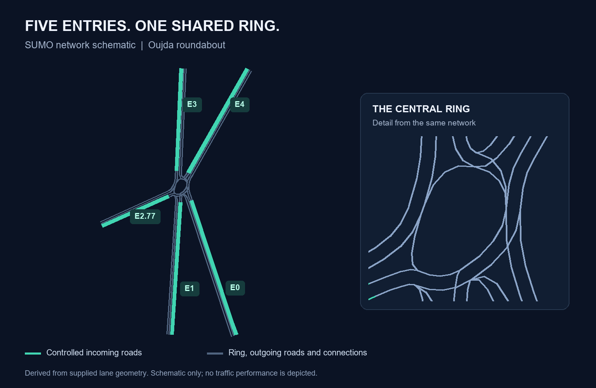
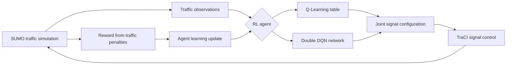

# Smart Roundabout Control with Q-Learning & Double DQN

**Adaptive signal control for a five-entry roundabout in Oujda, Morocco.**

A simulation-based project exploring how Q-Learning and a Double Deep Q-Network (Double DQN) can choose traffic-light configurations from observed traffic conditions. Python connects the agents to SUMO through TraCI.

**Portfolio by ALLAOUI Yassine · Academic team project · Private implementation**



*Topology drawn directly from the project's SUMO network. This is a schematic, not a screenshot or a performance result.*

## Problem

A roundabout with five incoming roads must accommodate competing traffic flows while keeping its central ring moving. Fixed signal programs do not use the agent's observations to adapt their decisions. This project explores traffic-responsive control in a simulated version of an Oujda roundabout.

## Solution

The control loop reads traffic measurements, selects a joint configuration for five signals, advances the simulation, and updates the agent from the resulting penalty.

- **Q-Learning:** a compact table with five traffic states and four actions.
- **Double DQN:** a neural value function with eleven state variables and twelve actions in the selected reference implementation.
- **SUMO + TraCI:** vehicle simulation, traffic measurements, and signal control.

The project covers network modeling, agent implementation, reward design, and experimental analysis. It remains a simulation prototype; a reliable numerical comparison is still pending.

## Demo

The network schematic above shows the modeled environment. A recorded demonstration of the reference agents is not yet included. Opening the SUMO scenario runs its configured signals; agent-controlled traffic requires the Python controller as well.

## System Architecture



*The algorithms use different state representations, action sets, and reward functions. Their raw reward values should not be compared as a common performance score.*

## Reinforcement Learning Environment

| Component | Q-Learning | Double DQN reference |
|---|---|---|
| State | Five discrete categories: clear traffic, three dominant approach groups, or a blocked ring | Six vehicle-count features and five signal-phase indices |
| Actions | Three approach-group openings and one all-red configuration | Twelve joint configurations, including all-red |
| Reward | Stopped-vehicle penalties plus penalties for ring segments containing stopped vehicles | Queue, prolonged-stop, ring-occupancy, and ambulance-wait penalties |
| Decision timing | Seven simulation steps per action | Fifteen action steps, with up to three yellow and three clearance steps during a change |
| Episode | Configured around 3,600 simulation steps | Configured around 3,600 simulation steps |

The neural controller observes five approach queues and the total number of vehicles on selected ring edges. Waiting times are used in its reward calculation but are not part of its eleven input features. See [methodology](docs/methodology.md) for the exact distinctions and known limitations.

## Q-Learning

The tabular agent groups the incoming roads into three combinations. A blocked ring takes precedence when classifying the state. Its Q-table persists between episodes within one training run.

| Setting | Reference value |
|---|---|
| Q-table | 5 states × 4 actions |
| Learning rate α | 0.1 |
| Discount γ | 0.9 |
| Initial ε | 1.0 |
| ε decay | × 0.995 after each decision |
| Intended ε floor | 0.05 |
| Configured episodes | 7 |

Configured episode counts are not evidence that a complete run was performed.

## Double Deep Q-Network

The selected implementation uses **TensorFlow/Keras**, an **11 → 32 → 32 → 12** dense network, ReLU hidden activations, and a linear output. The main network selects the next action and the target network evaluates it in the learning target.

| Setting | Reference value |
|---|---|
| Optimizer / loss | Adam / mean squared error |
| Learning rate | 0.001 |
| Discount γ | 0.9 |
| Replay capacity | 3,000 transitions |
| Batch size | 32 |
| Replay schedule | Every 5 decisions when enough transitions are available |
| Target update schedule | Every 30 decisions; counter restarts each episode |
| Exploration | ε starts at 1.0; × 0.975 after each episode; intended floor 0.05 |
| Configured episodes | 120 |

This version includes yellow/clearance handling and an ambulance-wait penalty. It does **not** implement dynamic action masking or a rule that forces green for ambulances.

## Technologies

Python · SUMO · NetEdit · TraCI · NumPy · TensorFlow/Keras

## Experimental Results

**No verified improvement percentage is reported.** The available evidence does not yet establish a reproducible Q-Learning versus Double DQN benchmark.

| Evidence | Current status |
|---|---|
| Academic comparison figures | Present in project documents; their link to the selected code and raw test data is not established |
| Training CSV | Three episodes; insufficient for a convergence claim; producing version unconfirmed |
| Saved neural models | Different input dimensions and hidden layers from the selected implementation |
| Matched Q-Learning / Double DQN tests | Not yet verified |
| Fixed-signal reference | Scenario execution checked; a matched evaluation remains to be conducted |

The next comparison will use traffic metrics in common units, matched demand and seeds, and explicit reporting of unfinished trips and simulation teleports. See the [experimental evidence and evaluation plan](docs/experiments.md).

## My Contribution

**ALLAOUI Yassine** contributed across the project: SUMO network modeling, Q-Learning, neural-agent development, and experimental evaluation.

The academic project was completed with **EL AAMRI Ayoub, EZZARI Aimane, and ZAI El Mahdi**, under the supervision of **Ouariachi Hanifi**. These credits distinguish individual portfolio ownership from collective project authorship.

## Project Structure

```text
smart-roundabout-control-rl/
├── README.md
├── assets/
│   └── network-overview.png
├── docs/
│   ├── methodology.md
│   └── experiments.md
└── .gitignore
```

This repository is a documentation showcase. Source code, trained weights, raw data, and executable SUMO files are maintained privately, so there is no public installation procedure.

## Limitations

- Findings concern a single simulated roundabout, not deployment on public roads.
- The selected controller and archived models come from different implementation versions.
- Reward scaling, target initialization, and episode-boundary handling need correction before a new evaluation.
- The scenario supplied for review contains ordinary cars; it does not establish the ambulance functionality experimentally.
- A scenario-only run encountered blocked traffic and vehicle teleports; these must be measured in subsequent evaluations.
- Different observations, actions, timing, and transition handling confound a direct attribution of any difference to the learning algorithm alone.
- Yellow phases and hand-selected actions do not constitute a validated traffic-safety system.

## Future Improvements

1. Establish one reproducible private implementation and associate each model with its exact configuration.
2. Correct the known learning and measurement issues, then run matched evaluations against fixed signals.
3. Add a recorded SUMO demo and publish aggregate results once their provenance is verified.
4. Explore shared control constraints, broader traffic scenarios, and multi-intersection coordination.

These are planned improvements, not completed features.

## Commercial Use / Custom Development

The implementation is maintained privately. Custom traffic-simulation studies, adaptations, and commercial licensing can be discussed upon request, subject to technical validation and an agreed scope. This prototype is not presented as a production-ready road-control product.

No open-source license is granted for the private implementation or trained models through this showcase.
